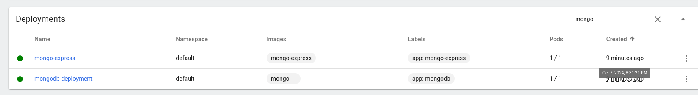
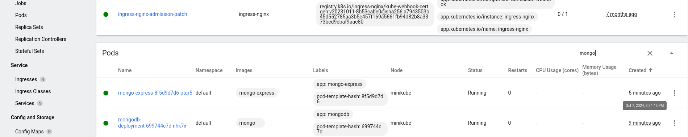
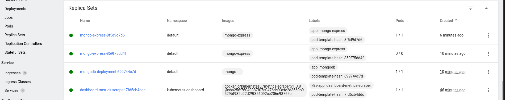
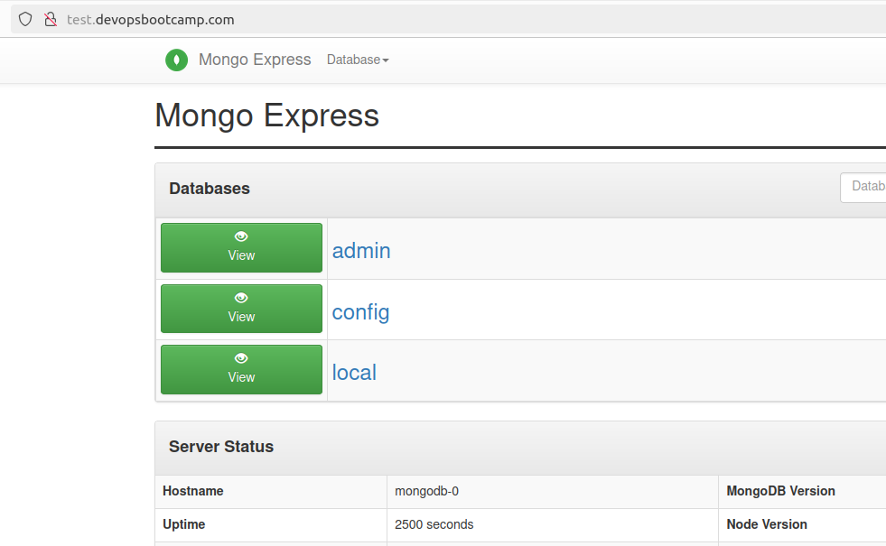
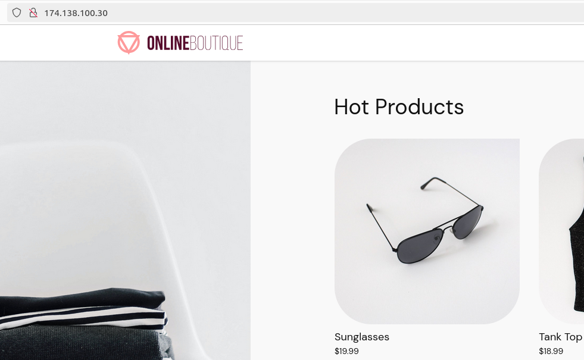
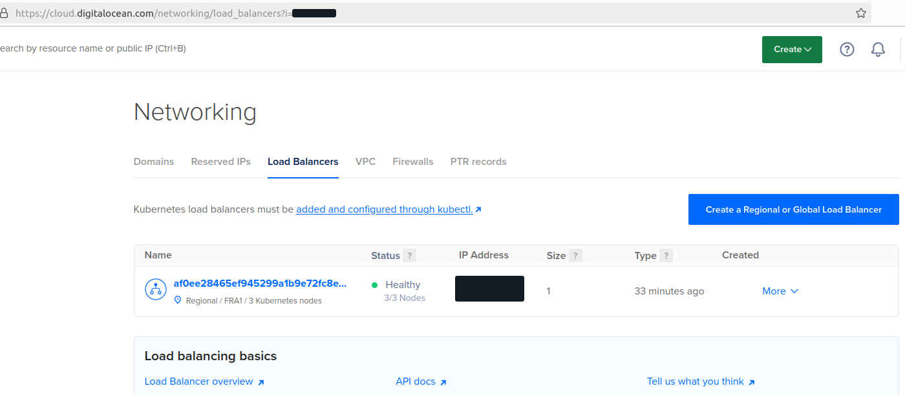

# Demo Projects - Kubernetes

##  Deploy to local k8s cluster
# 1. MongoDb with MongoExpress

I am using minikube.
So I installed it and started it using:
``` bash
curl -Lo minikube https://storage.googleapis.com/minikube/releases/latest/minikube-linux-amd64   && chmod +x minikube
cp minikube /usr/local/bin && rm minikube
minikube start --driver=docker
```

Then first deploy the Secrets and Configmap as they need to be created before the any of the containers are deployed:
``` bash
kubectl apply -f mongo-secret.yaml
kubectl apply -f mongo-configmap.yaml
``` 

Afterwards deploy the rest.

The UI can be accessed after exposing it by running:
``` bash
minikube service mongo-express-service
```






# 2. Mosquitto Msg Broker
Starting from the starting code (https://gitlab.com/twn-devops-bootcamp/latest/10-kubernetes/configmap-and-secret-volume-types.git):
Deploy the secrets and configmap first (otherwise the container will fail while startup as it is depending on them to be existing).
```bash
kubectl apply -f mosquitto/config-file.yaml
kubectl apply -f mosquitto/secret-file.yaml
```
and aftwards deploy the app itself:

```bash
kubectl apply -f mosquitto/mosquitto.yaml
```
by mounting the configmap and the secrets using a volume mount we can then use those volumes to mount the respectiv data (config or secrets) into our container and overwrite default config.
in the mongo case we used env vars based on the configmap/secret.
Here we create files using the volume mounts.


# 3. Helm - managed k8s cluster
I used digital ocean as I did not want to create another account on a new cloud provider
* First I created the k8s cluster via the do UI
* get the config file and use this for kubectl
``` bash
export KUBECONFIG=/home/jonas/.kube/do-kubeconfig
```
* deploy mongo db using helm chart:
``` bash
helm install mongodb --values helm-managed-cluster/helm-mongodb.yaml bitnami/mongodb
```
* then deploy the [](./helm-managed-cluster/helm-mongo-express.yaml)
``` bash
kubectl apply -f helm-managed-cluster/helm-mongo-express.yaml
```
* afterwards add the nginx repo to helm
``` bash
helm repo add ingress-nginx https://kubernetes.github.io/ingress-nginx
```
* Then deploy the nginx ingress
``` bash
helm install nginx-ingress ingress-nginx/ingress-nginx --set controller.publishService.enabled=true
```
By adding controller.publishService.enabled=true we make sure to automatically allocate a public IP for the ingress adress using nginx.
After adding a new DNS entry to my digital ocean account and direct the test.devopsbootcamp.com hostname to the public IP of the loadbalancer and adjusting the /etc/hosts file I could successfully acces the UI:



# 4. Private container registry
after "ssh-ing" into minikube using
``` bash
minikube ssh
```
run the command:
``` bash
docker login --username AWS --password <<password>> <<myawsid>>.dkr.ecr.us-east-1.amazonaws.com
```
password can be retrieved using 
```bash
aws ecr get-login-password --region us-east-1
```
but you would need aws configured

Afterwards we can cp the config.json
``` bash
minikube cp minikube:/home/docker/.docker/config.json /home/jonas/
```
Then we base64 encode the file:
``` bash
cat /home/jonas/config.json | base64 
```
the output can then be put into [the secrets yaml file](private-docker-repo/docker-secret.yaml).

Then adjust the [deployment yaml](private-docker-repo/my-app-deployment.yaml) including the imagePullSecrets section.
The ImagePullPolicy makes sure, that the image will allways be pulled even though it might exist on the local registry.
Afterwards the app can be deployed using kubectl apply.

# 5. Deploy microservice app in digital ocean k8s cluster
1. create k8s cluster and connect to it (export KUBECONFIG etc.)
2. after the cluster has been created we create a namespace 'microservice' and deploy the microservice app using
``` bash
kubectl apply -f microservice-app/config.yaml --namespace microservice
```
3. Afterwards we can access the frontend:



4. We incorporate some security best practices for container deployments in k8s
    1. use fixed image versions
        This is very import as not using fixed versions can break your environment. If you do not use a version it will always take latest. So in case of a major change there is a possibility of breaking changes.
    2. use Health checks (liveness and readiness probes)
        * health probes make sure the pod starts only in case the container starts properly
        * it also restarts the pod in case it crashes
        * include the liveness probe using http/grpc/tcpSocket protocol (depending on how the app has been implemented)
        * the liveness probe checks if the application is up and running
        * for the startup process we need the readiness probe - so kubernetes checks within a specified period if the application is ready(up)
    3. Define resource requests for eacht container
        * some apps may need more resources than others
        * therefore it is a best practice to define this for each application
        * This can be easily done using the
        ``` yaml
        resources:
          requests: 
            cpu: 100m
            memory: 64Mi
        ```
        section.
        * to avoid that too many resources will be allocated for an app which goes bonkers we use limits:
        ``` yaml
        resources:
          limits: 
            cpu: 200m
            memory: 128Mi
        ```
        * ***Note*** If you put numbers larger than your biggest node the pod will never schedule
    4. Don't expose a NodePort
        * Exposing a NodePort opens a port on each Worker Node where it can be directly accessed (multiple access points to the cluster)
        * Only use internal services and have one entrypoint the cluster (ideally it should outside the cluster)
        * Use the LoadBalancer type:
        ``` yaml
            spec:
                type: LoadBalancer
        ```

        * This will be the cloud providers load balancer (on do):

            
        
        * An alternative would be Ingress

    5. Configure more than 1 Replica for the Deployment
        * In case a pod crashes the application will still be available as there is another replica running

#### Some general Security Best practices

    1. More than 1 Node for the cluster
        * With only one Node --> single point of failure
        * If the node goes down everything breaks
        * Therefore node replication is also essential
        * Ideally each replica runs on a different node --> This assures redundancy in case a node crashes
    
    2. Using labels for all resources
        * labels are key-value pairs, that attach to k8s components

    3. Using namespaces
        * You can define access rights based on namespaces and therefore have a seggregation of different apps in different namespaces
        * namespaced permissions --> role/roleBinding

    4. Images are free of vulnerabilities
        * Scans via scan tools e.g. trivy

    5. No Root Access for containers
        * A container with root access can acces more resources on the host it is running.
        * If a privileged container is hacked a lot of damage could be done!

    6. Update the cluster the lates version
        * security fixes and bug fixes are mostly included in the latest versions
        * To update you would need to do it node by node (again an argument for having multiple nodes)

# 6. helm chart for microservice

As the deployments for the microservice do not really differ except for some namings and ports there is a lot of redundancy.
Therefore it makes sense to create a helm chart for such a service and deploy the microservices passing some arguments.

To create the helm chart we execute:
``` bash
helm create microservice
```
This genereates a folder with some files and subfolders.
```tree
microservice
    charts/
    templates/
    .helmignore
    Chart.yaml
    values.yaml
```

#### Chart.yaml 
desdribes the metadata of the chart (version, type, etc.)

#### charts/
holds any dependencies this chart might have.

#### .helmignore
files you don't want to include in your helm chart in case you want to package (it is similar to the .gitignore file)

#### templates/
The heart of the helm chart. here you define the template files for the respective components the app does include.
The placeholders (variable names) are defined by. e.g.:
```yaml
{{ .Values.service.type }}
```

#### values.yaml
actual values for the template files (default values) which will be overwritten by the ones passed over the cli using another values file or the --set parameter

After cleaning up the templates folder and keeping only the [deployment](./microservice-helm-chart/charts/microservice/templates/deployment.yaml) and [service](./microservice-helm-chart/charts/microservice/templates/service.yaml) yaml files we create them accordingly.
(to loop over a list of key value pairs for the env vars we can use the - range - end notation.)
We also define some default values in the [values file](./microservice-helm-chart/charts/microservice/values.yaml).
Afterwards we create (usually outside the chart folder) the [respective file](./microservice-helm-chart/values/emailservice-values.yaml) for a service (here the emailservice).

To check if the component configs are created and the vars are properly populated and it is valid we can use:
``` bash
helm template -f emailservice-values.yaml microservice
```
or/and
``` bash
helm lint -f emailservice-values.yaml microservice
```

As the redis cart depends on an official image (redis) and has a different deployment we could either add that deployment to the chart, or create a new chart.
``` bash
helm create redis
```

To automatically install the whole microservices app we use the [installation shell script](./microservice-helm-chart/install.sh).
And the other [one](./microservice-helm-chart/uninstall.sh) to uninstall it.

Or we can also use a [helmfile](./microservice-helm-chart/helmfile.yaml).
To create alle apps defined in the [helmfile](./microservice-helm-chart/helmfile.yaml) run:
``` bash
helmfile sync
```

To delete everything:
``` bash
helmfile destroy
```